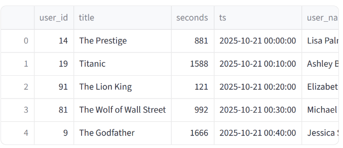
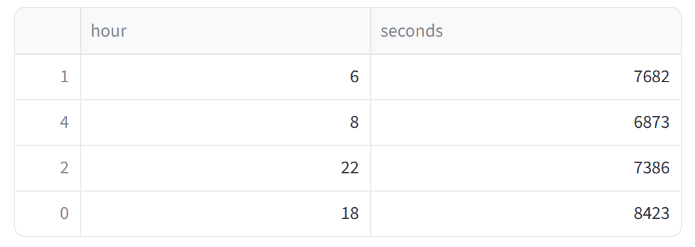

# Netflix — Timebucket Watch Stats

## Overview

This repository contains a short solution to compute the total number of seconds watched per hour for a specific date (October 21, 2025) and return the top 5 hours with the highest aggregated watch time.

Each log entry in the dataset contains the following fields:
- `user_id` — unique identifier for the viewer
- `title` — the movie/show title
- `seconds` — number of seconds watched in the session
- `ts` — timestamp of the session (format: `YYYY-MM-DD HH:MM:SS`)

## Goal

Aggregate total watch time (`seconds`) per hour (0–23) for the date `2025-10-21`, then output the top 5 hours by total seconds watched.

## Assumptions

- The `ts` timestamp is in `YYYY-MM-DD HH:MM:SS` format and represents local time for the event.
- Only sessions with a date of `2025-10-21` should be considered.
- Grouping is done by hour (ignore minutes and seconds).

## Approach (what the solution does)

1. Parse `ts` as a datetime object.
2. Extract the date and hour from the timestamp.
3. Filter records to `2025-10-21`.
4. Group by `hour` and sum the `seconds` column.
5. Sort totals descending and take the top 5 hours.

The provided `solution.py` implements this approach using `pandas`.

## Running the solution

Note: `solution.py` expects a DataFrame named `data` to be available (this is how the evaluation harness provides input). There are two ways to run the script:

1. In the evaluation environment (where `data` is injected):

   - Simply run:

   ```bash
   python solution.py
   ```

2. Locally for testing with a CSV file:

   - Create a CSV with columns: `user_id,title,seconds,ts`.
   - Add a small snippet at the top of `solution.py` to load the CSV for local testing, for example:

   ```python
   import pandas as pd

   # local test helper: uncomment when running locally
   # data = pd.read_csv('data.csv')
   ```

   - Then run:

   ```bash
   python solution.py
   ```

## Expected output

The script prints a `pandas` DataFrame with two columns: `hour` and `seconds`, showing the top 5 hours by total seconds watched (sorted descending by `seconds`). Example format:

```
   hour   seconds
0     20  1234567
1     21   987654
...
```

## Dependencies

- Python 3.8+
- pandas

Install dependencies (example):

```bash
pip install pandas
```

## Files

- `solution.py` — solution implementation (uses a DataFrame named `data`).

## Notes

- If you want, I can add a small CLI wrapper to `solution.py` to accept a CSV path and date argument for easier local testing.

---

Image: (dataset preview placeholder)


🧠 Netflix - Timebucket Watch Stats

You are provided with a dataset containing Netflix user watch session logs. Each log entry contains the user_id, title of the movie/show, seconds watched, and a timestamp (ts). Your task is to compute the total number of seconds watched per hour for October 21st, 2025, and then return the top 5 hours with the highest total seconds watched.

The goal is to aggregate the total watch time per hour across all users for the specified date and return the top 5 hours with the highest total seconds watched.
🦄 Assumptions

    The ts timestamp in the dataset is in the format YYYY-MM-DD HH:MM:SS.

    You are specifically asked to compute the total seconds watched for October 21st, 2025.

    The time should be grouped by the hour, meaning you will ignore the minute and second components of the timestamp.

    The seconds value represents the total watch time for a session and should be summed up per hour.

💡 Hint

    Ensure that you handle the timestamp correctly by converting it to a datetime object and then extracting the date and hour.

    Group the data by the date and hour columns and aggregate the seconds using the sum() function.


📊 Dataset Preview:


🔍 Sample Output Preview (for reference)

⚠️ Note: This is only an illustrative preview — actual output may differ.

