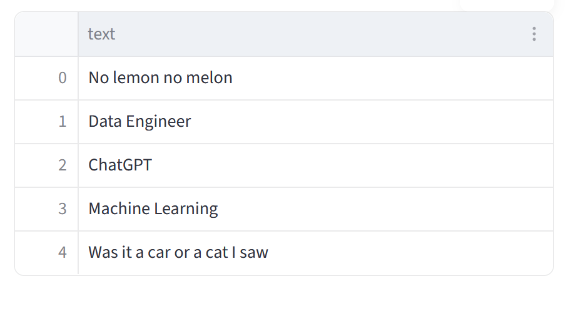
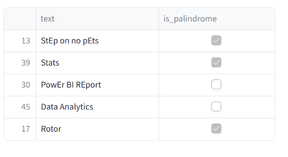

## 🧠 Palindrome Check

You are given a string. Your task is to determine whether it is a palindrome — meaning it reads the same forwards and backwards — while ignoring spaces and letter case.

## Examples

- "Race car" → Palindrome
- "Data Analytics" → Not a palindrome

Your function should return a DataFrame with a single column named `is_palindrome` containing a boolean value (`True` or `False`).

## 🦄 Assumptions

- Input DataFrame contains one column: `text`.
- Palindrome check must be case-insensitive and ignore spaces.
- Return a DataFrame with one row and one column: `is_palindrome`.
- Only alphabetic characters and spaces are considered (ignore punctuation).

## 💡Hint

- Convert the string to lowercase and remove spaces before checking.
- You can reverse a string using slicing (`[::-1]`).
- Compare the cleaned string with its reversed version.

## 📊 Dataset Preview

## 🔍 Sample Output Preview (for reference)

⚠️ Note: This is only an illustrative preview — actual output may differ.

